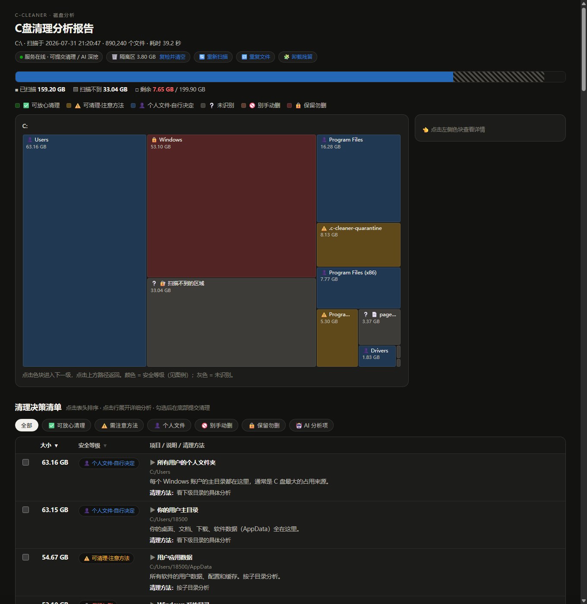

# c-cleaner — 带 AI 判定的磁盘清理分析器

> **EN** — A Windows disk-space analyzer like SpaceSniffer/WizTree, plus an **AI brain**:
> for every space hog it tells you *what it is, whether it's safe to delete, and how*.
> Pure Python stdlib, zero dependencies, runs offline. Scans ~900k files in ~20 s.
> Nothing is ever deleted automatically — cleanups go to a reviewable, restorable
> quarantine first. AI features (via local Claude CLI) are optional.
> Run `python main.py`, browse the interactive report at `127.0.0.1:8756`. MIT licensed.

像 SpaceSniffer 一样扫描磁盘占用，但多了 **AI 大脑**：自动告诉你每个占空间的目录
**是什么、里面装了什么、能不能删、怎么删**。工具本身**永远不会自动删除任何文件**——
清理先进可复检、可还原的隔离区，删不删始终由你决定。



## 使用

```bash
python main.py              # 扫描 C 盘 → 分析 → 生成报告 → 启动服务并打开浏览器
python main.py D:\          # 扫描其他盘
python main.py --ai         # 让 Claude CLI 自动分析知识库不认识的大目录
python main.py --static     # 只生成静态报告不起服务（只读模式）
python serve.py             # 报告已生成时，单独启动服务 http://127.0.0.1:8756
```

纯 Python 标准库，无需安装任何依赖（Python ≥3.10）。扫描 86 万文件约 20 秒。
Windows 双击 `重新扫描.bat` / `启动报告.bat` 亦可。

**个人保护规则**：复制 `user_rules.example.json` 为 `user_rules.json`，写入你永远不想删的
路径（如聊天记录、笔记缓存），它们会以最高优先级判为 🔒保留，AI 和社区规则都无法覆盖。

**AI 功能（可选）**：装有 [Claude Code](https://claude.com/claude-code) 时自动启用
（AI 深度分析 / 批量判定未识别目录）；未安装则相关按钮置灰，其他功能不受影响。

## 报告功能

- **Treemap 磁盘地图**：点击色块逐级下钻，颜色 = 安全等级
- **安全等级**（图标+颜色双重标注，色盲友好）：
  - ✅ 可放心清理 ⚠️ 可清理但需注意方法 🚫 别手动删 🔒 保留勿删 👤 个人文件 ❔ 未识别
- **可排序决策清单**：点表头按"大小"或"安全等级"排序（像资源管理器一样）
- **行内详情抽屉**：点击任意行展开——内部构成、实时深挖（最大文件/类型分布/最近修改时间）、
  按需"🤖 AI 深度分析"（调用本机 Claude，点了才生成）
- **逐项浏览判定**（文件浏览器）：抽屉/详情面板里点"📂 逐项浏览判定"，
  像资源管理器一样逐层进入任意目录，每个文件/子目录带判定徽章+理由
  （知识库精确命中 → 目录名/扩展名启发式 → 祖先规则兜底 三级判定），
  未识别项一键"🤖 AI 判定"批量出结论
- **提交清理**（服务模式）：勾选 → 底部操作栏"提交清理" → 确认弹窗 →
  仅 ✅ 级自动执行，默认**移入隔离区**（`C:\.c-cleaner-quarantine`，可反悔），
  确认系统正常后"清空隔离区"才真正释放空间；⚠️/👤 级只给手动方法，工具不代劳
- **安全闸门**：服务端白名单校验，非 ✅ 级路径一律拒绝清理；服务只监听 127.0.0.1
- **占用预检**（防"删缓存导致程序崩溃"）：提交清理时自动枚举全部进程，
  检测是否有程序正从待清理目录里运行（如 uvx/npx 把工具装在缓存里跑的情况），
  占用中的项自动排除并显示进程名；服务端在 /api/clean 里还会强制复检，不信任前端
- **隔离区复检**（清空前最后一道闸）：清空前逐个文件扫描隔离区，
  按"不可再生特征"（文档/设计源文件/数据库/存档/密钥等 20+ 类）标出可疑文件；
  按批次显示和操作；每批带 manifest 清单（记录原路径，同回收站 $I 元数据思路），
  支持"↩ 还原此批次"一键原路放回

## 双击直接打开 report.html？

也可以（file:// 只读模式）：排序、筛选、treemap、清理计划文本都可用，
但提交清理和实时深挖需要 `python serve.py`。

## 开源集成（v1.2）

| 来源 | 借鉴内容 | 在本项目中 |
|---|---|---|
| [MoscaDotTo/Winapp2](https://github.com/moscadotto/winapp2) (CC-BY-SA-4.0) | 4000+ 条社区清理规则 | `winapp2.py` 导入器：本机 Detect 评估 → 1400+ 条目录规则并入判定引擎；隐私类条目自动降级为"自行决定"级 |
| [BleachBit](https://github.com/bleachbit/bleachbit) | 预览两段式、白名单、winapp2 解析 | 架构对齐（独立实现） |
| [Czkawka](https://github.com/qarmin/czkawka) | 重复文件查找 | 🔁 按大小分组+内容指纹（头1MB+尾64KB），报告内一键清理副本 |
| [Bulk Crap Uninstaller](https://github.com/Klocman/Bulk-Crap-Uninstaller) | 卸载残留检测 | 🧩 注册表已装清单 vs Program Files 实际目录比对 |
| Windows 回收站 $I 元数据 / 杀毒软件隔离区 | 原路径清单、还原机制 | 隔离区 manifest + 整批还原 |

更新社区规则：重新下载 `data/winapp2.ini` 后运行 `python winapp2.py`。

## 文件结构

| 文件 | 作用 |
|---|---|
| `scanner.py` | 扫描引擎：os.scandir 递归、跳过 junction 防重复计数、长路径支持、容忍无权限目录 |
| `knowledge.py` | 知识库：90+ 条 Windows 常见占空间目录的说明、安全等级、清理方法 |
| `analyze.py` | 把扫描树和知识库匹配，产出识别项 + 未识别项（交给 AI） |
| `report.py` | 生成交互式 HTML 报告 |
| `main.py` | 一键入口 |
| `output/ai_notes.json` | AI 对未识别目录的分析结果（`--ai` 自动生成，也可手工编辑） |

## 已知限制

- 无管理员权限时读不到：pagefile.sys、System Volume Information（还原点）、
  WindowsApps 等，报告中归入"扫描不到的区域"（用 PowerShell/设置面板单独查）
- WinSxS 等目录存在硬链接，显示大小会大于实际独占空间
